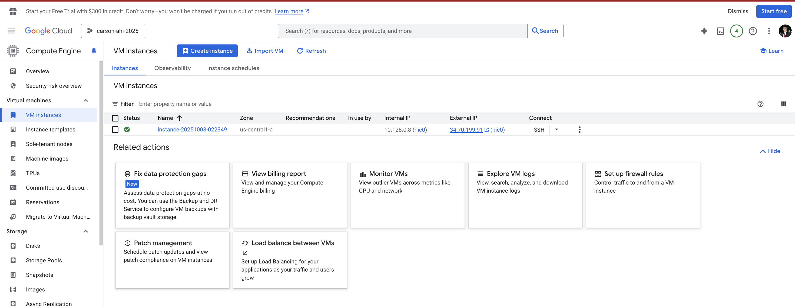
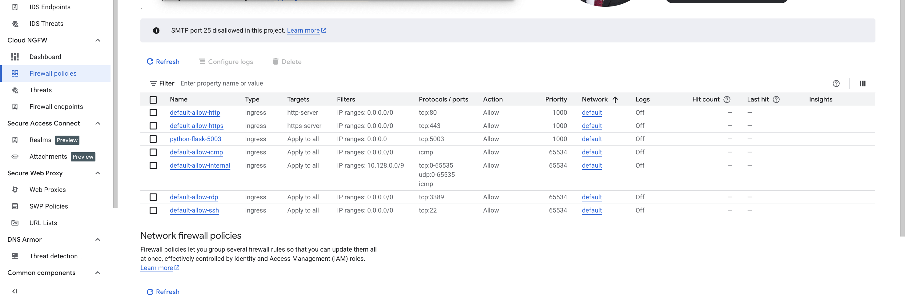
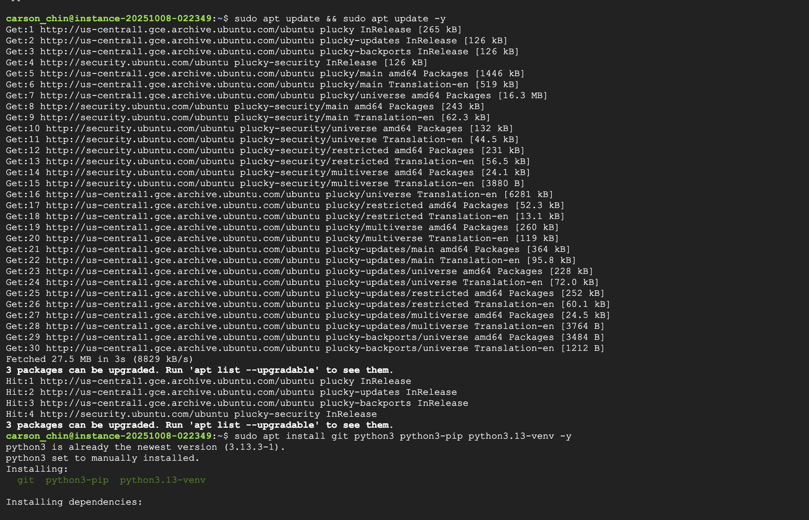
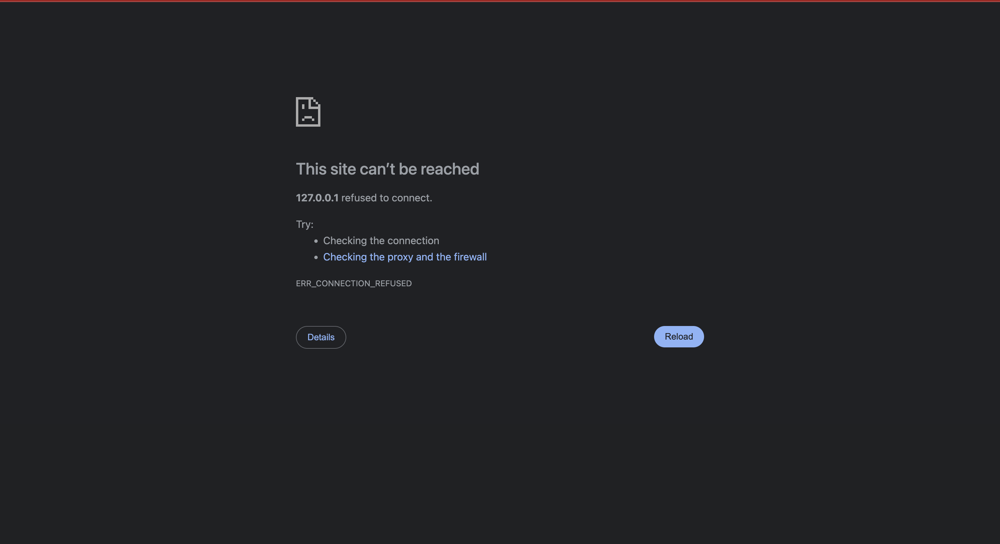
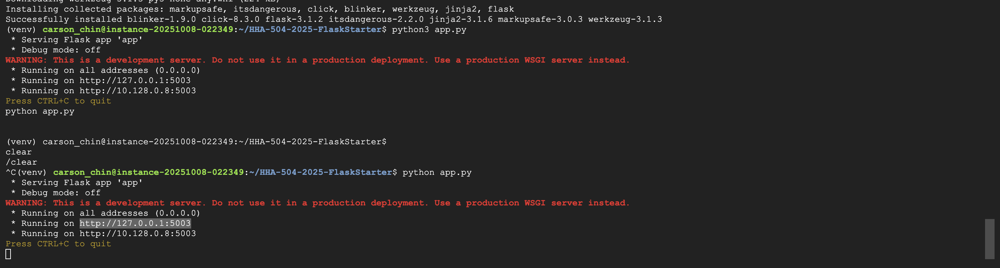
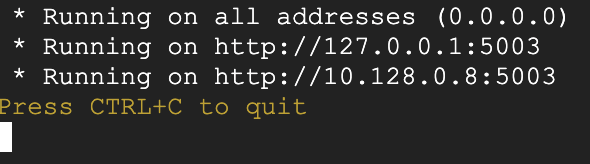

# Flask on Cloud VM (Assignment 2)

## Student Info
- Name: Carson Chin  
- Cloud Provider: Google Cloud  

## Video recording: 
- Zoom/Loom:
    - https://www.loom.com/share/ae98042a54f84cbe8d629868c057ae00?sid=a5fbcae1-d574-4de6-928e-ebff1022d601
    - https://www.loom.com/share/99ae5c80f8f64bb7951150b238282123?sid=ac68c728-d4c3-4535-96f2-a784f0873d08

## Steps
### 1. VM Creation

### 2. Networking (Port 5003 Open)

### 3. OS Update + Python Install

### 4. Flask App Running

### 5. Public IP Access
URL: http://127.0.0.1:5003  

### 6. (Bonus) Domain Name
Domain: http://mydomain.tech:5003  
[screenshot]